# The School Connect Project Documentation

## Setup

A lot of the project was built on Ubuntu, a Linux distribution but this guide assumes that you have a Windows OS (any version should work), a working browser, command prompt (or terminal) and a knowledge of how directory path works (won't need it much, but still helpful!). Also, it'll be a good idea to use a text editor. I've used Sublime Text for the project. Do note that the screenshots are from Linux but you should have no trouble following them. 

Also, install NodeJS on your system which should install NPM automatically. 
Link to install NodeJS: https://nodejs.org/en/
I recommend installing the LTS.

## Getting started

The project is made in VueJS, the JavaScript framework. You need to first install the VueJS package into your system using NPM (Node Package Manager). First, check your version of NPM usign the command line:
```
npm --version
```
If it gives a reply, your NodeJS installed succesfully. If it didn't, it's vital you do it now.

Now, install VueJS v3 on your computer using the command:
```
npm install -g @vue/cli
```

Check your VueJS version:
```
vue -V
```
If the result is 3.x or greater, go right ahead. If it's giving unexpected results, try re-installing Vue.

Now that the installation has been dealt with, go ahead and create a new Vue app using the command:
```
vue create the-school-connect
```
It should give you a menu based selection system where you can go ahead and select vue-router, vuex, node-sass, babel and eslint.

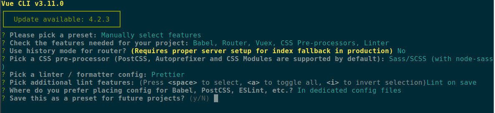

After that change the directory to the newly created directory named after the app.

```
cd the-school-connect
```

Then, to get a live preview of the app, run the command:

```
npm run serve
```

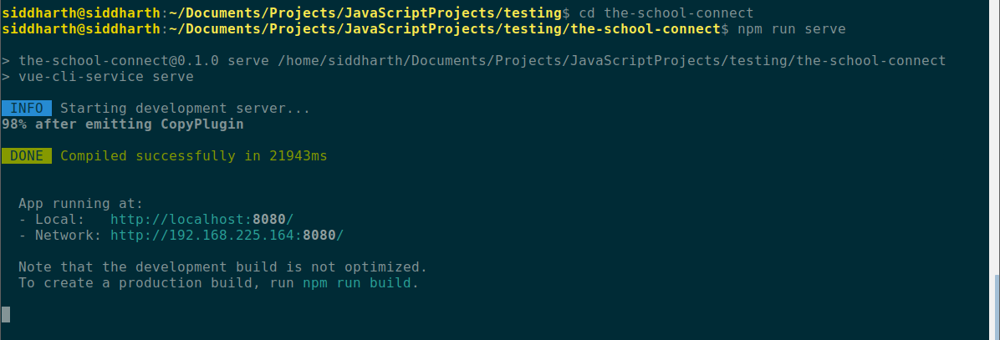

If you check the code using a text editor, you'll see a pre-made boilerplate code. Check the browser as well. A localhost should open up which look more or less like this.

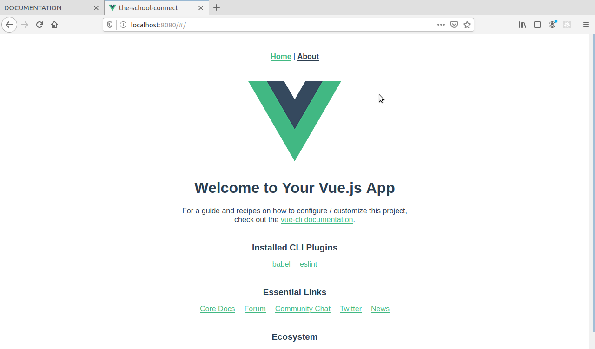

For now, let's not tamper with the boilerplate code. We'll do that soon.

Now, we need to install Vuetify, the material design framework used in this project.

```
vue add vuetify
```
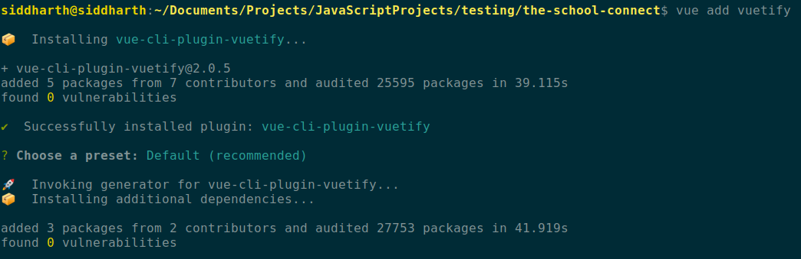

Next, let's install Google's Firebase and save it as a dependency.

```
npm install --save firebase
```

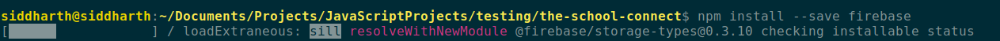

Perfect! Let's start with the UI now.

## The User Interface

We have now configured the entire app according to our dependencies, so now let's start with our front end.

Before we do that, here's a small explanantion of the file structure used by VueJS.

```
the-school-connect
|| node_modules
|| public
	|+ favicon.ico
	|+ index.html
|| src
	|| assets
		|+ logo.png
		|+ logo.svg
	|| components
		|+ HelloWorld.vue
	|| plugins
		|+ vuetify.js
	|| router
		|+ index.js
	|| store
		|+ index.js
	|| views
		|+ About.vue
		|+ Home.vue
	|+ App.vue
	|+ main.js
|+ .browserlistrc
|+ .eslintrc.js
|+ .gitignore
|+ babel.config.js
|+ package-lock.json
|+ package.json
|+ README.md
|+ vue.config.js
```

`App.vue` is the main vue file in the entire project. The other vue files are in the folders `components` and `views`.

**Brief explanation on what the folders `components` and `views` actually are.** Views are used to design the pages on the front-end while components are used to design specific components like a navigation bar component. We will not be using much of `components` in the project.

Now we'll clean up the code in all the files in `views` folder and `App.vue` so that it looks pretty much like this:

```
<template>
  <v-app>
    <v-app-bar
      app
      color="primary"
      dark
    >
      
    </v-app-bar>

    <v-content>

    </v-content>
  </v-app>
</template>

<script>

export default {
  name: 'App',

  components: {
    
  },

  data: () => ({
    //
  }),
};
</script>
```

Clean up the other files in the same way.

Now we need to start by creating the navigation bar of the app and work on the router. We'll need an icon on the left side of the navigation bar with three dashes to indicate the presence of a navigation drawer. Next, we'll need the text which shows us the name of the app. Now, leaving some space in the middle, we'll need a bunch of buttons with various requirements. 

The icon on the left will only be visible if the device is small. The group of buttons on the left will be invisible on smaller devices. We'll be using some CSS helper classes from Vuetify for this.

```
<!-- App.vue template -->

<v-app-bar app class="primary">
      <v-app-bar-nav-icon
        class="hidden-sm-and-up"
        @click.stop="drawer = !drawer"
      ></v-app-bar-nav-icon>

      <v-toolbar-title>
        <router-link to="/">
          <span class="grey--text text--lighten-2 display-1">THE</span>
          <span class="black--text text--lighten-2 display-1">SCHOOL</span>
          <span class="grey--text text--lighten-2 display-1">CONNECT</span>
        </router-link>
      </v-toolbar-title>

      <v-spacer></v-spacer>

      <v-toolbar-items class="hidden-xs-only">
        <v-btn router to="/signup" link depressed large class="primary">
          <v-icon left>mdi-traffic-light</v-icon>
          Sign Up
        </v-btn>
        <v-btn to="/signin" link depressed large class="primary">
          <v-icon left>mdi-account</v-icon>
          Sign In
        </v-btn>
        <v-btn depressed large class="primary" @click="signOut">
          <v-icon left>mdi-logout</v-icon>
          Sign Out
        </v-btn>
      </v-toolbar-items>
    </v-app-bar>

    <v-navigation-drawer v-model="drawer" app>
      <v-list>
        <v-list-item link router to="/signup">
          <v-list-item-icon>
            <v-icon>mdi-traffic-light</v-icon>
          </v-list-item-icon>
          <v-list-item-content>
            <v-list-item-title>Sign Up</v-list-item-title>
          </v-list-item-content>
        </v-list-item>
        <v-list-item link router to="/signin">
          <v-list-item-icon>
            <v-icon>mdi-account</v-icon>
          </v-list-item-icon>
          <v-list-item-content>
            <v-list-item-title>Sign In</v-list-item-title>
          </v-list-item-content>
        </v-list-item>
        <v-list-item link router @click="signOut">
          <v-list-item-icon>
            <v-icon>mdi-logout</v-icon>
          </v-list-item-icon>
          <v-list-item-content>
            <v-list-item-title>Sign Out</v-list-item-title>
          </v-list-item-content>
        </v-list-item>
      </v-list>
    </v-navigation-drawer>
```

```
<!-- App.vue data() inside <script> tag -->

data: () => ({
  drawer: false
}),
```

The navigation bar should look sleek now. Here's a picture of it from a desktop browser.


Here's how it looks on a mobile phone device.


**Now that the nav bar is working, we need to create the other important views.**

At this point, go ahead and create the new files in `views` folder.

- `Dashboard.vue`
- `Home.vue`
- `SignIn.vue`
- `SignUp.vue`

After creating these files, go to the folder `router` and inside it `index.js` file. Please don't confuse it with `store/index.js` file.

At the top of the file, import the following newly created files.

```
import Home from "../views/Home.vue";
import Dashboard from "../views/Dashboard.vue";
import SignUp from "../views/SignUp.vue";
import SignIn from "../views/SignIn.vue";
```

Next, add the routes to the `routes` array as an object. We are going to making a single page application, which means that the website won't reload everytime a person wants to move to another page. The navigation bar component is the only part of the page along with the footer which won't reload. The rest of the page will reload as per the user's input.

Here's how your routes object should look like after adding the components.

```
const routes = [
  {
    path: "/",
    name: "Home",
    component: Home
  },
  {
    path: "/dashboard",
    name: "Dashboard",
    component: Dashboard,
    meta: {
      requiresAuth: true
    }
  },
  {
    path: "/signup",
    name: "SignUp",
    component: SignUp
  },
  {
    path: "/signin",
    name: "SignIn",
    component: SignIn
  }
];
```

Now that the routing is sorted out, we will need to make the UI of all the new views we just created. We used a bunch of Vuetify components to ease down the process, to give us more freedom saving us from all the unnecessary and extensive coding and also make it look beatiful. The code can be found [here](https://github.com/Drac5079/the-school-connect/tree/master/src/views) and it is really very much similar to HTML and very intuitive to understand so we won't be going over the logic of everything. 

Great. We are now done with the UI and now, we reach the fun part where we integrate Firebase into the app!

## Vuex Store

Now we'll have to work on the Vuex store found in `src/store/index.js`.

Update the file with following lines of code:

```
import Vue from "vue";
import Vuex from "vuex";

Vue.use(Vuex);

export const store = new Vuex.Store({
  state: {
    user: null,
    posts: []
  },
  mutations: {
    updateUser(state, { user }) {
      Vue.set(state, "user", user);
    }
  },
  getter: {
    user: state => state.user
  },
  actions: {}
});
```

This should help in the authentication process.

## Firebase

First we need to go to the Firebase console to initialize a new project.

https://console.firebase.google.com/

Create a new project by clicking "Add Project". 

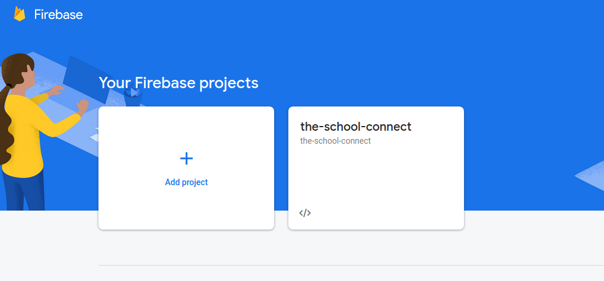

Enter the project name. Next, you will be asked to enable Google Analytics which we disabled (for now). 

Click on "Continue". It should take a few moments to load up the project window.

After the page has loaded click on the Web icon to add a web app to the project.

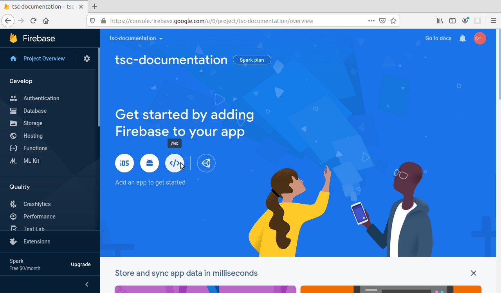

Now you have to register the app. We will set up the hosting in the future.

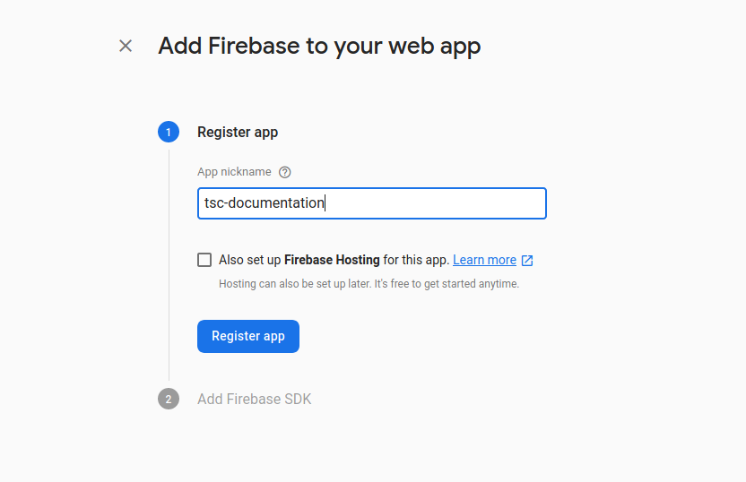

Now you'll be presented with a bunch of code. Copy the code in the JavaScript script tags.

Create a new file called `firebase.js` in your `src` folder.

Now, at the top of the file, import Firebase (we installed it as a dependency in the Getting Started part ) and Vuex store:

```
import firebase from "firebase";
import store from "./store/index.js";
```

Below it, paste the code you copied earlier:

```
  var firebaseConfig = {
    apiKey: "", // insert your own apiKey 
    authDomain: "", // insert your own authDomain 
    databaseURL: "", // insert your own databaseURL 
    projectId: "", // insert your own projectId
    storageBucket: "", // insert your own storageBucket
    messagingSenderId: "", // insert your own messagingSenderId
    appId: "" // insert your own appID
  };

  // Initialize Firebase
  firebase.initializeApp(firebaseConfig);
```

I removed the tokens from the strings because they are sensitive information and need to be protected. Be sure not to post these tokens anywhere on the internet and not to share them with untrusted people.

Now go to your project's console on Firebase and make your way into Firebase Authentication Tab on the right hand side of your screen.

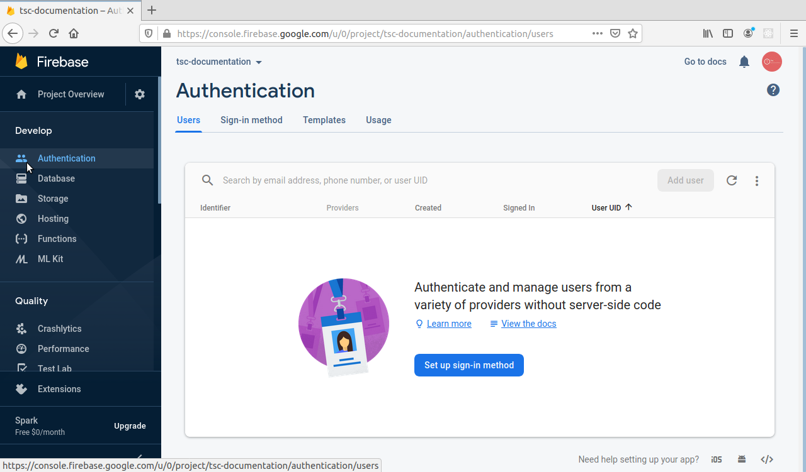

Click on "Set up sign-in method" and enable Email/Password provider. 

Now, we should enable Firebase's database provder Firestore for storing of posts.

Go to the Database tab. Firebase has two types of databases - Realtime Database or Firestore. We had to make a decision here and went with Firestore, a better version of Realtime Database. The both are NoSQL databases and save data in JSON formats.

Now you can enable the Firestore Database.

Click on Create Database.

Here, we will start in production mode.

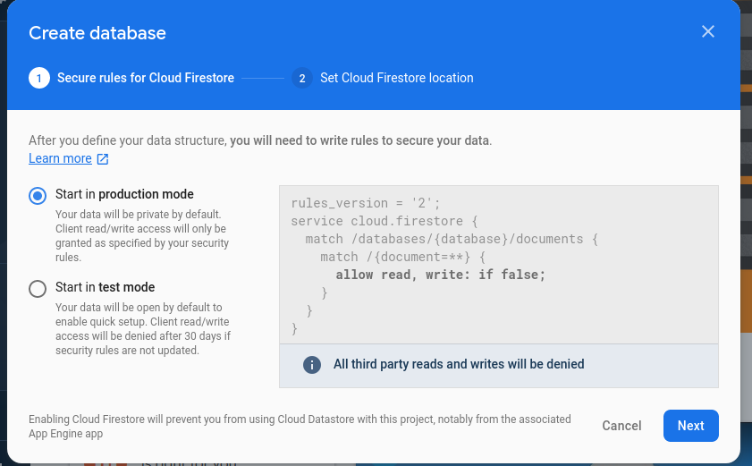

Next, select the cloud location. This is a crucial step and it cannot be changed in the future. Server latency depends on this location and location of client. 

We chose `asia-east2` for this project. Click Done. It should take a few moments to provision the Database and set up security rules. After it is done, you'll be able to see the blank database.


Before we go into programming, we'll need to modify the database a little bit to act as a reference point for the code and a way of underdstanding the database for us humans.

Click on start collection and give it a name. We will call it `posts`. This `posts` collection should act as a reference to the code. Now, inside the `posts` collection, make a new document to act as a reference for the programmers. Here's how it should look:

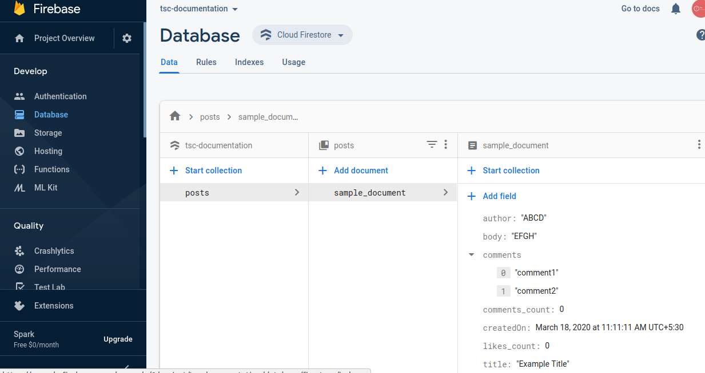

We will delete it later but let's keep it for now.

Now, we will complete the entire code of `firebase.js` file.

Below your Firebase initialisation, add these lines of code:

```
// firebase utils
const db = firebase.firestore();
const auth = firebase.auth();
const currentUser = auth.currentUser;

auth.onAuthStateChanged(user => {
  store.commit("updateUser", { user });
});

// firebase collections
const postsCollection = db.collection("posts");

export { db, auth, currentUser, postsCollection };
```

`db`, `auth`, and `currentUser` are all variables depending on the Firebase API.

the `onAuthStateChanged` event listener is used to listen to any change in Authentication events and if there is any change, it will update the Vuex store.

The `postsCollection` constant is the place where our sample document is stored and where all the new posts will be stored when the user/client creates a new one.

Now we can go to the Firebase Authentication's Users tab. We can now write down the code for Signing Up, Signing In and Signing Out. 

Make your way to `src/views/SignUp.vue` file where we will write our logic for signing up our users.

You'll need to import the `firebase.js` file as well.

```
const fb = require("../firebase.js");
```

From the UI's sign up form, we'll bind the variables `username`, `email` and `password`. Their initial values should be `null` (or it can be an empty string, if that's what your prefer) unless updated in the form.

Our `data()` should look like this:

```
data() {
  return {
    username: null,
    email: null,
    password: null
  };
}
```

Below it, create an object called `methods` where we will write (you guessed it), our methods for the view.

We already have a button in our form which should trigger a function to sign up the user when clicked. 

```
<v-btn class="darker" elevation="1" @click="signUp">
  Sign Up
</v-btn>
```

Now, let's write down the `signUp()` function logic inside the `methods` object

```
methods: {
  signUp: function() {
    // console.log(this.username);
    // console.log(this.email);
    // console.log(this.password);

    fb.auth
      .createUserWithEmailAndPassword(this.email, this.password)
      .catch(function(error) {
        alert("We found an error\n" + error.code + "\n" + error.message);
      });
    this.$router.push("/dashboard");
  }
}
```

We are using `this` to refer to the parent object we are using which has the three variables `username`, `email` and `password`. The commented out `console.log()` statements are only for debugging purposes.

`createUserWithEmailAndPassword()` is a function which, you guessed it, creates a new user using the email and password credentials. 

`this.$router.push("/dashboard")` is self-explanatory line which takes the user to the dashboard page.

Now we can create our sign in logic in `SignIn.vue`. It is similar to the sign up feature.

It needs the email ID and password so we get it in the same way we got it earlier. I will only write down the logic here.

```
  methods: {
    signIn: function() {
      fb.auth
        .signInWithEmailAndPassword(this.email, this.password)
        .catch(function(error) {
          alert("We found an error\n" + error.code + "\n" + error.message);
        });
      this.$router.push("/dashboard");
    }
  }
```

It works in the same way the sign up function works so there is also no need for explanation. 

Now, we need to add the feature where the user can create a new post.

We'll go to `src/views/Dashboard.vue`.

Just like the previous sign up and sign in components, this will also require some things from the UI so we will bind them the same way we did earlier. 

Then we will get the `posts` document reference from our Firestore database and push a new document in it. 

Inside, the methods object, do this:

```
post: function() {
      fb.db
        .collection("posts")
        .add({
          createdOn: new Date(),
          title: this.post_title,
          body: this.post_body,
          comments_count: 0,
          likes_count: 0,
          comments: [],
          author: this.author
        })
        .then(function() {
          location.reload();
        })
        .catch(function(error) {
          alert("Error adding doc: \n" + error);
        });
    },
```

This will add a new document is the database.

Now for the post rendering.

We'll create a function to fetch all posts and then call the function as and when the page loads.

Here's the function, again inside the methods object.

```
getDocs: function() {
      fb.db
        .collection("posts")
        .get()
        .then(snapshot => {
          snapshot.docs.forEach(doc => {
            this.posts.unshift(doc.data());
            //console.log(doc.data().title);
          });
        });
    }
```

The function won't be called though. How do we call it as and when the page loads? VueJS has a simple helper function, thankfully. It's called 'beforeMount()'. Here's how to use it.

```
beforeMount() {
  this.getDocs();
}
```


